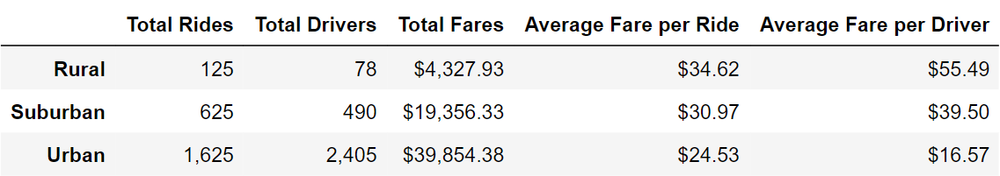

# PyBer_Analysis

## Overview

This exploratory analysis showcases the differences in ride-sharing data among the different city types to help PyBer improve access to ride-sharing services, as well asdetermine affordability for underserved neighborhoods.

## Resources

* [city_data.csv](Resources/city_data.csv)
* [ride_data.csv](Resources/ride_data.csv)

## Development Environment

* Python 3.7.10
  * Pandas library
  * Matplotlib library
* Anaconda 4.10.3
* Jupyter Notebook 6.1.4

## Results

The number of total rides has a positive correlation with total drivers for each city type, as seen in Figure 1 below. Additionally, there is a negative correlation between amount of rides and the fare per ride, as well as the amount of drivers and the fare per driver.

*Figure 1: Ride-sharing summary by city type*

## Summary

Removing 9th grade math and reading scores from Thomas High School negatively impacted its ranking among other schools and had a ripple effect on district score categories that THS fell into.
