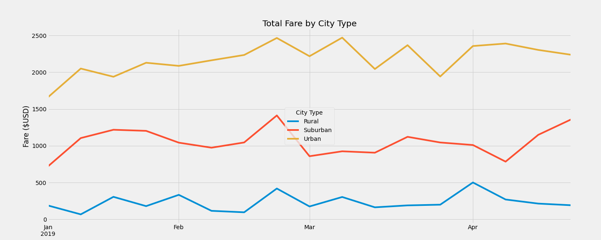

# PyBer_Analysis

## Overview

This exploratory analysis showcases the differences in ride-sharing data among the different city types to help PyBer improve access to ride-sharing services, as well as determine affordability for underserved neighborhoods.

## Resources

* [city_data.csv](Resources/city_data.csv)
* [ride_data.csv](Resources/ride_data.csv)

## Development Environment

* Python 3.7.10
  * Pandas library
  * Matplotlib library
* Anaconda 4.10.3
* Jupyter Notebook 6.1.4

## Results

The number of total rides has a positive correlation with total drivers for each city type, as seen in Figure 1 below. Additionally, there is a negative correlation between amount of rides and the fare per ride, as well as the amount of drivers and the fare per driver.

*Figure 1: Ride-sharing summary by city type*

Figure 2 shows rural cities generated the least revenue and urban cities generated the most revenue from January to April of 2019.

*Figure 2: Total revenue bu city type*

## Summary

Based on the analysis, PyBer should consider the following recommendations for each city type:
1. Decrease the fare per ride in rural cities to make rides more affordable.
2. Run promotions in suburban and urban cities in January to increase revenue.
3. Offer a sign-on bonus to new drivers in rural cities to increase total drivers, decrease waiting times, and attact more riders in rural cities.

